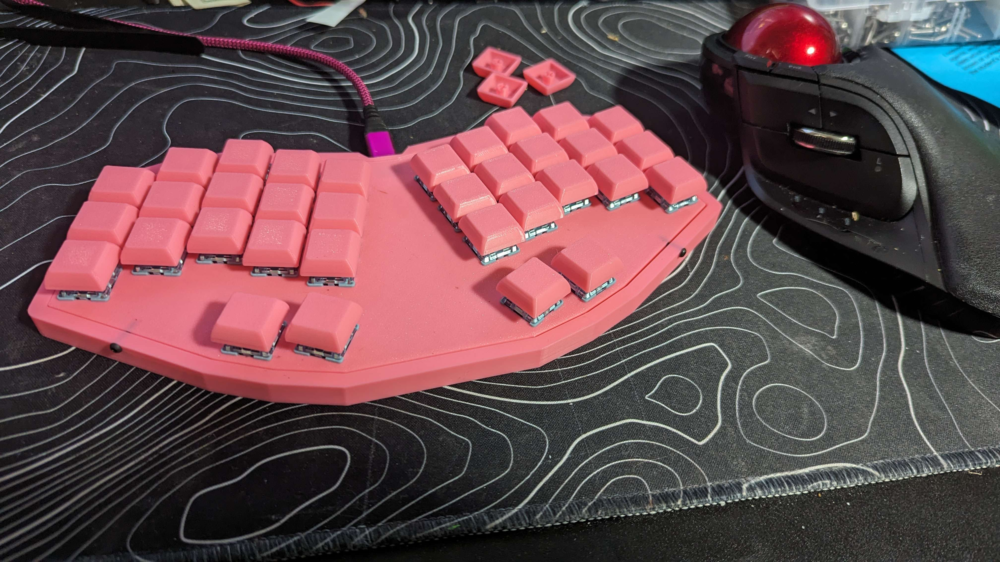

# Ch55p34

keyboard based on the ch552t Chip. 

Runs on [FAK firmware](https://github.com/semickolon/fak). I named it the Ch55p34 because it's "Ch55p." It is hot-swappable. 

I forgot to add mounting holes, and because of this, I had to find a way to mount the plate to the case.

You can use it without a case, or you can use the 3d printable case and plate that I designed. 

Four m2x10mm screws hold the plate in place. from the side. 

An unintended side effect is that it is about 7mm thinner than any other keyboard I've made with a case.

I may do this for the rest of my keyboards!
